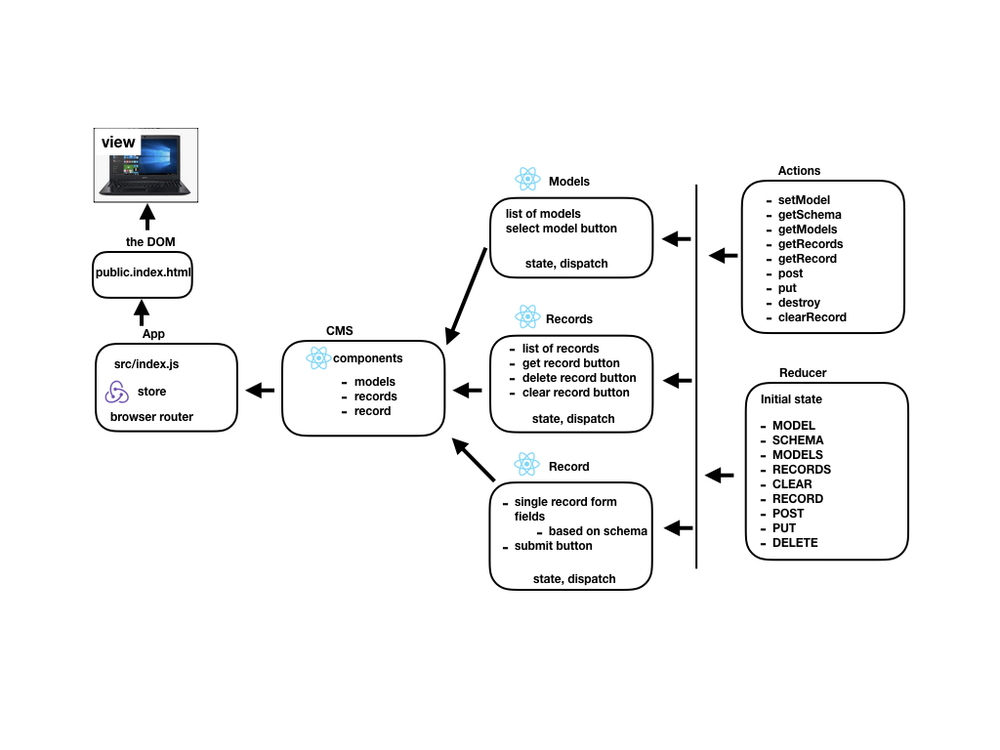

 LAB
=================================================

## Content Management System

### Author: Fletcher LaRue

### Links and Resources
* [repo](https://github.com/asdFletcher/35-project-cms)

* [front end](https://fl35projectcms-fl35projectcmsproject-h0t56cposjxo.s3.us-east-2.amazonaws.com/index.html)

### Setup
#### `.env` requirements
* REACT_APP_API=https://javascript-401-api.herokuapp.com/api/v1

#### Running the app
* `npm start`

---
This app has been deployed with authentication

Logging in to the deployed front-end:

username / passwords are as follows:

- user/USER
- editor/EDITOR
- admin/ADMIN

User has the following capabilities:
read

Editor has the following capabilities:
create, read, update

Admin has the following capabilities:
create, read, update, delete


---

### Files UML:

### Data UML:


---

### Testing

Testing for this project is accomplished using `react-scripts` built in testing:

In the `package.json` file, a script is setup for:
```
"test": "react-scripts test --env=jsdom",
```

To run a test:

```
npm test
```


